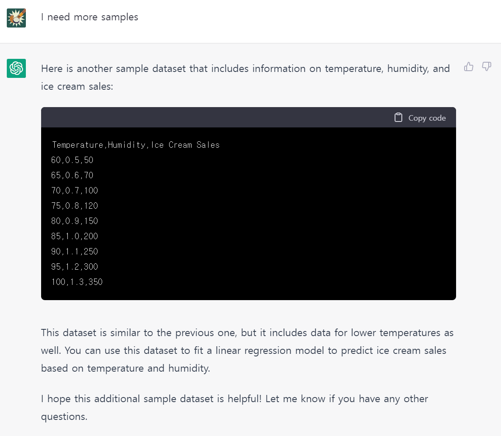

```{r setup, include=FALSE}
knitr::opts_chunk$set(echo = TRUE, message = F, 
                      warning = F, comment = "",
                      fig.height = 4)

options(knitr.duplicate.label = "allow")
xaringanExtra::use_share_again()
xaringanExtra::use_panelset()
```


# 데이터셋 &larr; chatGPT

.pull-left[



]

.pull-right[
> This dataset includes data on the **temperature (in degrees Fahrenheit)**, **humidity (as a fraction between 0 and 1)**, and **ice cream sales (in units)**. You can use this dataset to fit a linear regression model to predict ice cream sales based on temperature and humidity.
]


---
# 데이터셋 정제

.pull-left[
```{r ols_data}
library(tidyverse)
library(flipbookr)

sales_raw <- tribble(
  ~"Temperature",	~"Humidity",	~"Ice Cream Sales",
    60,0.5,50,
    65,0.6,70,
    70,0.7,100,
    75,0.8,120,
    80,0.9,150,
    85,1.0,200,
    90,1.1,250,
    95,1.2,300,
    100,1.3,350)

sales_df <- sales_raw %>% 
  set_names(c("온도", "습도", "매출"))

```

]

.pull-right[
```{r, echo=FALSE}
sales_df
```

]

---

`r flipbookr::chunk_reveal("ols_viz", break_type = 1, title = "### 단순 회귀모형 시각화")`


```{r ols_viz, include = F}
sales_df %>% 
  ggplot() +
    aes(x = 온도) +
    aes(y = 매출) +
    geom_point(color = "steelblue",
               size = 2) +
    geom_smooth(method = lm, se = F) +
    labs(title = "아이스크림 매출 예측",
         subtitle = "예측변수: 온도")
```

---
class: inverse, center, middle
# 단순 회귀모형

---

`r flipbookr::chunk_reveal("base_ols", title = "### 회귀모형 개발")`

```{r base_ols, include = FALSE}
# 데이터에 모형적합
lm(formula = 매출 ~ 온도,
   data = sales_df) ->
sales_model

# 모형 적합 후 잔차
sales_model %>% 
  summary() %>% 
  .$residuals
```


---

# 모형이 맞나? - `broom`

<br>
<br>
<br>

- broom::glance(), 모형(model) 수준에서 통계량 정보
- broom::tidy(), 공변수(covariate) 수준에서 통계량 정보
- broom::augment(), 관측점(observation) 수준에서 통계량 정보

---

`r flipbookr::chunk_reveal("broom_glance", title = "### *모형* 수준 통계량", left_assign = "detect")`

```{r broom_glance, include= FALSE}
sales_model %>% 
  broom::glance() %>% 
  pivot_longer(cols = everything(), 
               names_to = "통계량", 
               values_to = "값") ->
  sales_glance

sales_glance
```


---

`r flipbookr::chunk_reveal("broom_tidy", title = "### *공변수* 수준 통계량", left_assign = "detect")`

```{r broom_tidy, include= FALSE}
sales_model %>% 
  broom::tidy()
```


---

`r flipbookr::chunk_reveal("broom_augment", title = "### *관측점* 수준 통계량", left_assign = "detect")`


```{r broom_augment, include= FALSE}
sales_model %>% 
  broom::augment() 
```


---

`r flipbookr::chunk_reveal("broom_augment_viz")`

```{r broom_augment_viz, include = FALSE}
sales_model %>% 
  broom::augment() %>% 
  ggplot() +
    aes(x = `온도`) +
    aes(y = `매출`) +
    geom_point(col = "steelblue", size = 3) +
    geom_smooth(method = lm, se = F) +
    geom_point(aes(y = .fitted)) +
    aes(xend = 온도) +
    aes(yend = .fitted) +
    geom_segment(color = "red", 
                 linetype = "dashed") +
    # 평균온도
    geom_vline(xintercept = 80,
               linetype = "dotted") +
    # 평균온도 대입 시 예상매출
    geom_hline(yintercept = 
                 predict(sales_model, 
                         data.frame(온도 = 80)),
               linetype = "dotted") +
    labs(title = "모형적합 시각화")
```


---

`r flipbookr::chunk_reveal("sales_cooks", title = "### 이상점 - 쿡의 거리", left_assign = "detect")`

```{r sales_cooks, include = FALSE}
sales_model %>% 
  broom::augment() %>%
  mutate(id = row_number()) %>% 
  ggplot() +
  aes(x = id) +
  aes(y = .cooksd) +
  geom_point() +
  aes(label = id) +
  geom_text(check_overlap = T, 
            nudge_y = .015) +
  labs(title = "관측점 별 쿡의 거리(Cook's Distance)") +
  labs(subtitle = "쿡의 거리: Leave one out 방법으로 관측점 영향도를 측정") +
  geom_hline(yintercept = 4 / nrow(sales_df), 
             color = "red", linetype = "dashed") + # 컷오프: 4 / 표본크기
  annotate("text", x = 5, y = 0.5, label = "이상점 판정기준", size = 7, color = "red")

  
```


---

`r flipbookr::chunk_reveal("sales_qqplot", title = "### 잔차는 정규분포?", left_assign = "detect")`

```{r sales_qqplot, include = FALSE}
sales_model %>% 
  broom::augment() %>% 
  arrange(.std.resid) %>% 
  mutate(expected = qnorm((1:n() - .5)/n())) %>% 
  ggplot() +
    aes(y = .std.resid) +
    aes(x = expected) +
    geom_rug() +
    geom_point() +
    coord_equal(ratio = 1, 
                xlim = c(-4, 4),
                ylim = c(-4, 4)) +
    # add line of equivilance
    geom_abline(intercept = 0, 
                slope = 1, 
                linetype = "dotted") +
    labs(title = "정규 QQ플롯")
```

